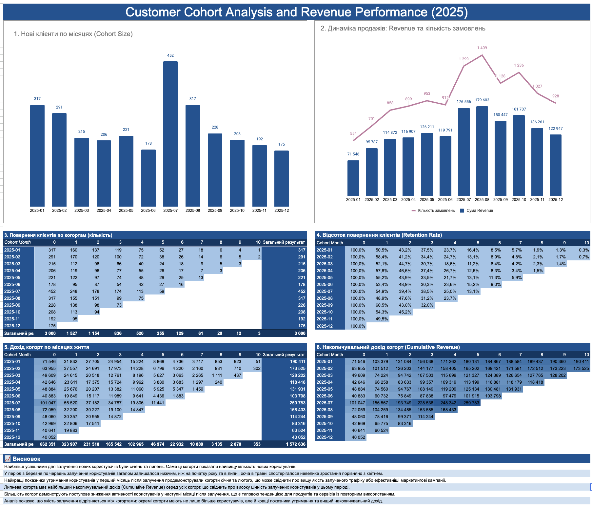

# Customer Cohort & Retention Analysis

Learning project created in Google Sheets to analyze customer cohorts, retention, revenue performance, and cumulative revenue over time.

## Business Goal

The goal of this project was to analyze customer behavior by cohort, measure retention over time, identify the strongest acquisition periods, and evaluate revenue performance across customer groups.

## Tools & Skills

- Google Sheets
- Cohort analysis
- Retention analysis
- Revenue analysis
- Cumulative revenue
- Data visualization
- Dashboard design
- Business analysis

## What I Did

- Grouped customers into monthly cohorts
- Calculated cohort size by acquisition month
- Measured customer retention across subsequent months
- Analyzed monthly revenue and number of orders
- Calculated cumulative revenue by cohort
- Built cohort tables and visualizations
- Created a dashboard for comparing acquisition, retention, and revenue performance
- Summarized the main business findings

## Key Insights

- January and July had the largest customer cohorts.
- Customer acquisition was lower during several months in spring and early summer.
- Retention declined over time across all cohorts.
- Early-month retention was stronger for several cohorts, especially January and February.
- July generated the strongest cumulative revenue among the analyzed cohorts.
- Revenue performance varied significantly between acquisition cohorts, showing that cohort size alone did not fully determine long-term value.

## Live Dashboard

🔗 [Open the interactive dashboard in Google Sheets](https://docs.google.com/spreadsheets/d/1FgRaRcS0_werpYrmhJ9Ilw_0lDiuaKLs-kGWwGmYdmM/edit?usp=sharing)

## Dashboard Preview

