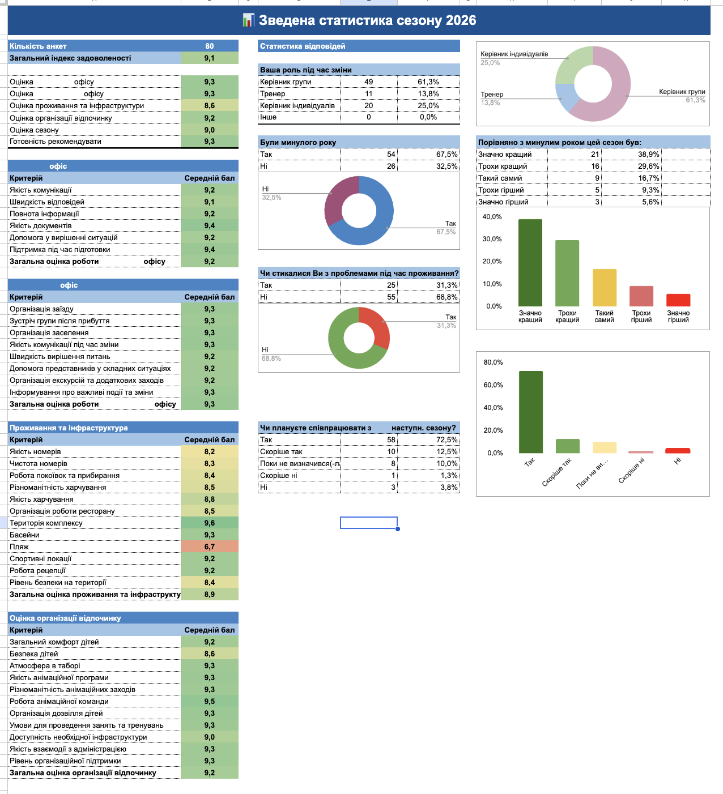
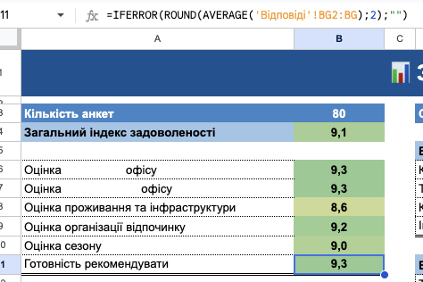
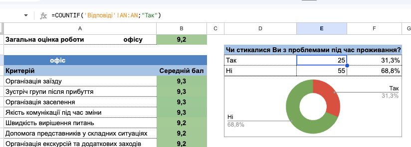

# Survey Dashboard

Google Sheets project for analyzing survey results and presenting key business insights through an interactive dashboard.

> Note: This portfolio version uses anonymized/demo data to protect confidential business information.

## Business Goal

The goal of this project was to analyze survey results, measure overall satisfaction, identify strong and weak areas, and present the results in a clear dashboard for management.

## Tools & Skills

- Google Sheets
- Data cleaning
- Formulas: AVERAGE, COUNTIF, IFERROR, ROUND
- Conditional formatting
- Charts and data visualization
- Dashboard design
- Business analysis

## What I Did

- Structured and cleaned survey response data
- Calculated average scores for key categories
- Counted and summarized survey responses
- Built visual indicators and charts
- Applied conditional formatting for quick performance assessment
- Created a management dashboard with key metrics and insights

## Key Insights

- Overall satisfaction score reached 9.1 out of 10.
- Office performance received strong ratings, with an overall score above 9.
- Accommodation and infrastructure scored lower than other categories.
- The beach received the lowest individual rating and was identified as an area requiring attention.
- Most respondents rated the current season better than the previous one.
- The majority of respondents planned to cooperate again next season.

## Dashboard Preview

## Formula Examples

### Average Calculation

### COUNTIF Example

